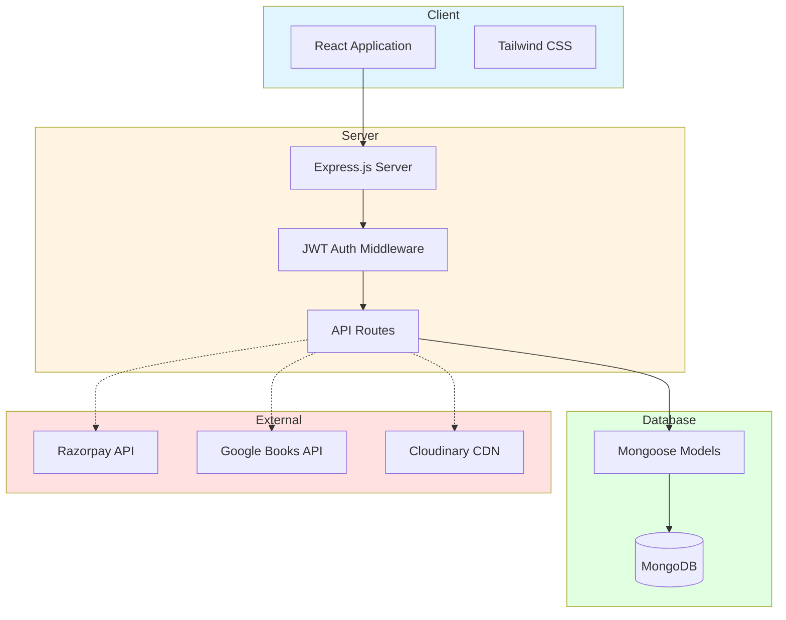

# 📚 BookBalcony – Academic Book Reselling Platform

<div align="center">

**A full-stack academic book marketplace connecting students to buy and sell educational books.**

[Features](#-features) • [Tech Stack](#️-tech-stack) • [Architecture](#-architecture) • [API Documentation](#-api-documentation)

</div>

---

## 📖 About BookBalcony

BookBalcony is a comprehensive web platform designed to simplify buying and selling academic books within the student community. The platform provides essential features like ISBN-based book validation, secure payment processing, real-time order tracking, and inventory management.

### Purpose

- Help students save money by buying used academic books
- Enable sellers to easily list and manage their book inventory
- Provide a secure and transparent marketplace for academic materials
- Reduce educational waste through book reuse

---

## ✨ Features

### For Buyers

- **Search & Browse** – Find books by title, author, ISBN, category, or language
- **Filtering** – Filter by price range, condition, and availability
- **Book Details** – View comprehensive information including seller details and book condition
- **Shopping Cart** – Add multiple books and checkout seamlessly
- **Payment Options** – Pay online via Razorpay or choose Cash on Delivery
- **Order Tracking** – Track your order status and delivery location in real-time
- **Address Management** – Save multiple delivery addresses

### For Sellers

- **Easy Listing** – Add books with ISBN auto-fill using Google Books API
- **Inventory Dashboard** – View and manage all your listed books
- **Stock Management** – Update stock quantities and product availability
- **Order Management** – View orders, update status, and add tracking information
- **Analytics** – Track revenue, total orders, and product performance
- **Notifications** – Get alerts for new orders and payment updates
- **Failed Payment Handling** – Manage orders with payment failures

### For Admins

- **User Management** – View and manage registered users
- **Product Approval** – Review and approve book listings
- **Order Monitoring** – Oversee all platform transactions
- **Platform Analytics** – View key metrics and statistics

---

## 🛠️ Tech Stack

### Frontend
- **React.js** – Component-based UI library
- **Tailwind CSS** – Utility-first CSS framework
- **React Router** – Client-side routing
- **Axios** – HTTP requests
- **Lucide React** – Icon library

### Backend
- **Node.js** – JavaScript runtime
- **Express.js** – Web framework
- **MongoDB** – NoSQL database
- **Mongoose** – MongoDB ODM
- **JWT** – Authentication tokens
- **Bcrypt** – Password hashing

### Third-Party Integration
- **Razorpay** – Payment gateway
- **Google Books API** – ISBN validation and book data
- **Cloudinary** – Image hosting and optimization
- **Nodemailer** – Email notifications
- **QRCode** – Order QR code generation

---

## 📊 Architecture



### Application Flow

1. **Client Layer** – React SPA with responsive Tailwind CSS design
2. **API Layer** – Express.js RESTful API with JWT authentication
3. **Business Logic** – Controllers handle book, order, and user operations
4. **Data Layer** – MongoDB stores users, books, orders, and notifications
5. **External Services** – Third-party APIs for payments, book data, and images

---

## 🔌 API Documentation

### Authentication

```
POST   /api/v1/auth/register       # User registration
POST   /api/v1/auth/login          # User login
POST   /api/v1/auth/logout         # Logout
```

### Books

```
GET    /api/v1/books               # Get all books (with filters)
GET    /api/v1/books/:id           # Get single book
GET    /api/v1/books/isbn/:isbn    # Validate ISBN
```

### Seller Operations

```
POST   /api/v1/seller/add-book              # Create book listing
PUT    /api/v1/seller/update-book/:id       # Update book
DELETE /api/v1/seller/delete-book/:id       # Delete book
GET    /api/v1/seller/myproducts            # Get seller's books
PUT    /api/v1/seller/update-stock/:id      # Update stock
GET    /api/v1/seller/orders                # Get seller's orders
PUT    /api/v1/seller/order/:id/status      # Update order status
POST   /api/v1/seller/order/:id/tracking    # Add tracking update
GET    /api/v1/seller/dashboard-stats       # Get dashboard stats
GET    /api/v1/seller/notifications         # Get new order notifications
```

### Orders

```
POST   /api/v1/orders/create       # Create new order
GET    /api/v1/orders/my-orders    # Get user's orders
GET    /api/v1/orders/:id          # Get order details
```

### Payments

```
POST   /api/v1/payment/create      # Initialize payment
POST   /api/v1/payment/verify      # Verify payment
```

### Admin

```
GET    /api/v1/admin/pending-approvals    # Get pending books
PUT    /api/v1/admin/approve-book/:id     # Approve/reject book
GET    /api/v1/admin/analytics             # Platform statistics
```

---

## 💾 Database Schema

### User Model
```javascript
{
  username: String,
  email: String,
  password: String (hashed),
  role: String, // 'user', 'seller', 'admin'
  addresses: Array,
  createdAt: Date
}
```

### Book Model
```javascript
{
  title: String,
  author: String,
  isbn: String,
  category: String,
  language: String,
  price: Number,
  stock: Number,
  condition: String,
  description: String,
  images: Array,
  seller: ObjectId,
  productStatus: String,
  adminApproval: String,
  views: Number,
  sold: Number,
  createdAt: Date
}
```

### Order Model
```javascript
{
  orderId: String,
  user: ObjectId,
  book: ObjectId,
  seller: ObjectId,
  orderStatus: String,
  paymentMethod: String,
  paymentStatus: String,
  amountPayable: Number,
  shippingAddress: Object,
  trackingHistory: Array,
  currentLocation: String,
  deliveryDate: Date,
  qrCode: String,
  createdAt: Date
}
```

### Notification Model
```javascript
{
  seller: ObjectId,
  orderId: ObjectId,
  book: ObjectId,
  amount: Number,
  isRead: Boolean,
  type: String,
  createdAt: Date
}
```

---

## 🔒 Security

- **Authentication** – JWT tokens with 7-day expiration
- **Password Security** – Bcrypt hashing with salt
- **Route Protection** – Middleware-based access control
- **Role-Based Access** – Different permissions for users, sellers, and admins
- **Input Validation** – Server-side validation of all inputs
- **Payment Security** – Razorpay handles sensitive payment data
- **HTTPS** – Encrypted data transmission
- **CORS** – Configured cross-origin resource sharing

---

## 🎯 Key Features Explained

### ISBN Validation

When sellers add a book, they can enter the ISBN number. The system automatically fetches book details (title, author, description, cover image) from Google Books API, making listing quick and accurate.

### Order Tracking

Sellers can add tracking updates with status and location information. Buyers see the complete tracking history with timestamps, providing transparency throughout the delivery process.

### Stock Management

Sellers can:
- Set initial stock quantity when listing
- Update stock levels anytime
- Automatic stock reduction when orders are placed
- Product status changes automatically (Available → Sold Out)

### Payment Processing

- **Online Payment**: Razorpay integration for card/UPI payments
- **COD**: Cash on Delivery option available
- **Payment Verification**: Webhook-based payment confirmation
- **Failed Payments**: Automatic handling with seller notifications

### Notification System

Sellers receive notifications for:
- New orders
- Payment failures
- Low stock alerts

Notifications are displayed in-app with read/unread status.

---

## 📱 User Interface

### Design Principles

- **Responsive Design** – Works on mobile, tablet, and desktop
- **Clean Layout** – Minimal and intuitive interface
- **Consistent Theme** – Dark theme with yellow accents
- **Loading States** – Visual feedback during operations
- **Error Handling** – Clear error messages and alerts
- **Accessibility** – Keyboard navigation and screen reader support

### Custom Components

- **Alert System** – Custom notification component with smooth animations
- **Product Cards** – Consistent card design for book listings
- **Order Cards** – Detailed order information display
- **Statistics Cards** – Dashboard metrics visualization
- **Modal Dialogs** – Order details and confirmation modals

---

## 🚀 Deployment

The application is designed for deployment on:

- **Frontend** – Vercel, Netlify, or similar static hosting
- **Backend** – Node.js hosting (Heroku, Railway, Render)
- **Database** – MongoDB Atlas (cloud database)
- **Images** – Cloudinary CDN

---

## 🔄 Order Lifecycle

```
1. Order Placed
   ↓
2. Processing (Seller prepares shipment)
   ↓
3. Shipped (Package handed to courier)
   ↓
4. Out for Delivery (In local delivery)
   ↓
5. Delivered (Order complete)
```

Sellers can update the status at each stage and add location-based tracking updates.

---

## 📊 Dashboard Analytics

### Seller Dashboard Shows:
- Total Revenue (completed payments)
- Pending Revenue (COD/pending payments)
- Total Orders
- Number of products listed
- Recent orders
- Product performance (views, sales)

### Admin Dashboard Shows:
- Total users
- Total books listed
- Pending approvals
- Platform-wide statistics

---

## 🛡️ Data Privacy

- User passwords are hashed and never stored in plain text
- Payment information is handled by Razorpay (PCI compliant)
- Personal data is used only for order fulfillment
- Email addresses are not shared with third parties

---

## 🎨 Color Scheme

- **Primary** – Yellow (#FBBF24) - CTA buttons, highlights
- **Background** – Zinc/Gray (#18181B) - Dark theme base
- **Success** – Green (#10B981) - Positive actions
- **Error** – Red (#EF4444) - Errors, alerts
- **Warning** – Amber (#F59E0B) - Warnings

---

## 📝 Current Limitations

- Single book per order (no multi-book checkout yet)
- Manual seller verification
- No in-app messaging between buyers and sellers
- No review/rating system for sellers
- Limited to Indian market (INR currency, Indian addresses)

---

## 🛠️ Development Tools

- **Git** – Version control
- **VS Code** – Code editor
- **Postman** – API testing
- **MongoDB Compass** – Database management
- **Cloudinary Console** – Image management

---

## 📦 Project Structure

```
bookbalcony/
├── frontend/
│   ├── src/
│   │   ├── components/     # Reusable UI components
│   │   ├── pages/          # Page components
│   │   ├── Alert/          # Custom alert system
│   │   └── App.jsx         # Main app component
│   └── package.json
│
├── backend/
│   ├── controllers/        # Request handlers
│   ├── models/            # Database schemas
│   ├── routes/            # API routes
│   ├── middleware/        # Auth & validation
│   └── server.js          # Express server
│
└── README.md
```

---

## 🎯 Target Users

### Primary Users
- **Students** – Looking to buy affordable academic books
- **Students** – Wanting to sell books they no longer need

### Secondary Users
- **Book Sellers** – Small businesses selling academic books
- **Educational Institutions** – Bulk book management

---

## ⚖️ License

This is a private project for portfolio/educational purposes.

**© 2026 BookBalcony. All rights reserved.**

---

## 👨‍💻 Developer

Built as a full-stack MERN project to demonstrate:
- RESTful API design
- React component architecture
- MongoDB database modeling
- Third-party API integration
- Payment gateway integration
- Real-time updates and notifications
- Authentication and authorization
- Responsive UI/UX design

---

<div align="center">

**Academic Book Marketplace Platform**

Built with React, Node.js, Express, and MongoDB

</div>